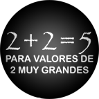

!SLIDE transition=scrollUp center

# A matemática particular do Matz

!SLIDE

# Conversão pra inteiro

    @@@ruby
    > (16.9 * 100).to_i
     => 1689

!SLIDE center

<a class='cc' href='https://secure.flickr.com/photos/dark_imp666/2119346894/'>CC-BY-NC-ND Brero @ Flickr</a>

!SLIDE

# Divisão por zero

    @@@ruby
    > 1/0
    ZeroDivisionError: divided by 0
    > 1/0.0
     => Infinity

<!-- TODO: Add cool image -->

!SLIDE

# Cadê o `Infinity`?
    @@@ruby
    > Infinity
    NameError: uninitialized constant Infinity
    > Math::Infinity
    NameError: uninitialized constant Math::Infinity
    > Float::Infinity
    NameError: uninitialized constant Float::Infinity
    > Float::INFINITY
     => Infinity
    > 1/0.0 == Float::INFINITY
     => true

!SLIDE center

<a class='cc' href='https://secure.flickr.com/photos/wactout81/5261826705/'>CC-BY-NC Lance Neilson @ Flickr</a>

!SLIDE

    @@@ruby
    > 1...Float::INFINITY
     => 1...Infinity
    > 1..Float::INFINITY
     => 1..Infinity
    > (1..Float::INFINITY).include? Float::INFINITY
     => true
    > Float::Infinity.is_a? Numeric
     => true

!SLIDE center

<a class='cc' href='http://www.pixar.com/'>Todos os direitos reservados a Pixar.</a>
