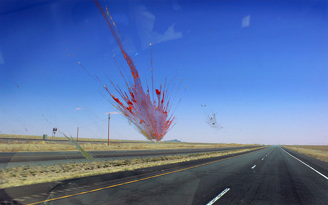

!SLIDE transition=scrollUp center

# splat

<a class='cc' href='https://secure.flickr.com/photos/paddymurphy/2403936281/'>CC-BY-NC PaddyMurphy @ Flickr</a>
!SLIDE

# splat

    @@@ruby
    def foo(*args, options)
      p args
      p options
    end

    foo(1, 2, 3, a: :b)
     => [1, 2, 3]
     => {:a => :b}

!SLIDE

# Assignment & splat

    @@@ruby
    first, *middle, last = [1, 2, 3, 4, 5]
     => first = 1
     => middle = [2, 3, 4]
     => last = 5

!SLIDE

# Assignment & splat

    @@@ruby
    x = *'foo'
     => ["foo"]
    y = *(1..5)
     => [1, 2, 3, 4, 5]
    z = *y
     => [1, 2, 3, 4, 5]
