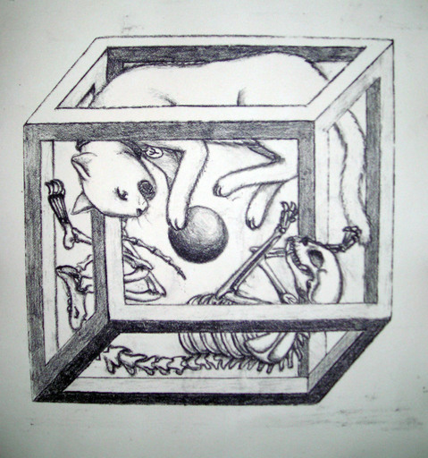
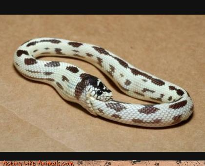

!SLIDE transition=scrollUp center

# Inicialização

!SLIDE

    @@@ruby
    > x = 1

    > def x; 2; end

    > x

!SLIDE

    @@@ruby
    > x
    > x()

!SLIDE center

<a class='cc' href='https://secure.flickr.com/photos/jieq/2371783536/'>CC-BY jieq @ Flickr</a>

!SLIDE

    @@@ruby
    > x
    NameError: undefined local variable or method `x' for main:Object
    > x = y
    NameError: undefined local variable or method `y' for main:Object

!SLIDE

    @@@ruby
    > x = x
    # ?????

!SLIDE center

<a class='cc' href='https://secure.flickr.com/photos/chinagrrrl/4254238760/'>CC-BY-NC-ND chinagrrrl @ Flickr</a>
